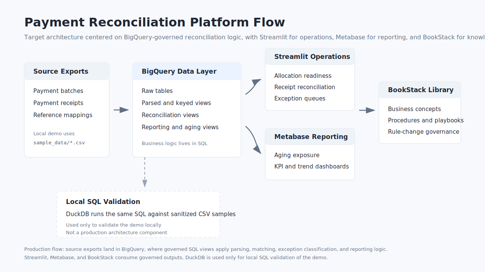

<p align="center">
  
</p>

<h1 align="center">Payment Reconciliation Platform</h1>

<p align="center">
  Public, sanitized case study of a financial reconciliation platform for SQL-governed matching, exception review, BI reporting, and procedural knowledge management.
</p>

## Quick Read

This project demonstrates how a spreadsheet-heavy financial operations process can be turned into a controlled reconciliation platform.

It is built as a recruiter-friendly case study: small enough to run locally, but structured like a real operating model with source evidence, governed SQL logic, analyst workflows, management reporting, and process documentation.

The public demo focuses on:

- matching internal payment batches to external receipt evidence;
- identifying open review queues instead of hiding them in spreadsheets;
- tracing receipt lines to the payment batches they support;
- separating chargebacks and rejected transactions from normal matched flows;
- showing how operational views, BI reporting, and business procedures can share the same governed logic.

The project is intentionally sanitized and compact. It does not contain private data, company-specific identifiers, or confidential production rules.

## Executive Summary

**Problem:** financial reconciliation often depends on spreadsheets, manual matching, repeated analyst judgment, and undocumented exception handling.

**Solution:** a SQL-centered workflow that parses source exports, generates deterministic matching keys, reconciles payment batches against receipts, classifies exceptions, and exposes the results through operational and reporting tools.

**Demo implementation:** Streamlit runs the reconciliation SQL live in DuckDB over sanitized CSVs. Metabase demonstrates the BI layer. BookStack demonstrates the procedural knowledge layer.

**What this shows:** finance operations knowledge, SQL-based business rule modeling, data quality thinking, workflow design, Docker-based local demos, and the ability to turn a real operating process into a reusable public case study.

## Business Problem

High-volume reconciliation becomes fragile when spreadsheets are the operating layer. Typical issues include:

- manual matching between payment batches, receipts, and external reference files
- duplicated rules across analysts or markets
- weak traceability of why a line was allocated, checked, or excluded
- slow exception handling
- slow rule changes when logic lives outside governed SQL

The platform reframes reconciliation as a governed workflow: raw evidence is preserved, SQL applies explicit rules, analysts work from structured views, and BI consumes the same controlled outputs.

## What The Demo Shows

The local demo runs directly from sanitized CSVs and rebuilds the reconciliation layer at runtime:

- `sample_data/` contains compact source exports for payment batches, receipts, and gateway reference mappings.
- `sql/` applies parsing, key generation, matching, reporting, and BI transformations.
- `app/streamlit_demo.py` runs the SQL live in DuckDB and presents analyst-facing workflows.
- `metabase/` provides optional BI seed data and a dashboard guide.
- `bookstack/` provides example knowledge-library content for procedures, concepts, and rule governance.
- `tests/` validates that the compact runtime still covers matching, review queues, chargebacks, and rejected transactions.

## Evaluation Path

For a quick technical review:

1. Read the case study summary below.
2. Run the Streamlit demo and open receipt reconciliation.
3. Inspect `sql/03_reconciliation_logic.sql` and `sql/04_reporting_views.sql`.
4. Run the validation scripts.
5. Optionally start Metabase or BookStack to see the reporting and governance layers.

## Architecture



The main design principle is simple:

> Keep business logic in SQL; keep applications thin, explainable, and replaceable.

## Repository Structure

```text
payment-reconciliation-platform/
|- app/                         # Streamlit operational demo
|- bookstack/                   # BookStack demo configuration and content examples
|- docs/                        # Architecture, business rules, walkthroughs, and assets
|- metabase/                    # Optional BI-facing demo artifacts
|- sample_data/                 # Sanitized source CSV samples
|- scripts/                     # Local DuckDB build and helper scripts
|- sql/                         # Reconciliation and reporting SQL layers
`- tests/                       # Live runtime validation checks
```

## Run The Streamlit Demo

```bash
pip install -r requirements.txt
streamlit run app/streamlit_demo.py
```

Open:

```text
http://localhost:8501
```

Direct receipt-reconciliation view:

```text
http://localhost:8501/?view=receipt&receipt=receipt_ref_001
```

Docker alternative:

```bash
docker build -f docker/Dockerfile -t payment-reconciliation-streamlit .
docker run --rm -p 8501:8501 payment-reconciliation-streamlit
```

## Run The BookStack Demo

```bash
cd bookstack
cp .env.example .env
docker run -it --rm --entrypoint /bin/bash lscr.io/linuxserver/bookstack:latest appkey
docker compose up -d
```

After replacing `APP_KEY` in `.env`, BookStack is available at:

```text
http://localhost:6875
```

## Run The Optional Metabase Demo

```bash
python3 scripts/export_metabase_seed.py
cd metabase
docker compose up -d
```

Metabase is available at:

```text
http://localhost:3000
```

If an existing Postgres volume contains older demo data, reset the Metabase demo with:

```bash
cd metabase
docker compose down -v
docker compose up -d
```

## Validate The Demo

Validate the compact sample design:

```bash
python3 tests/validate_examples.py
```

Validate the live SQL runtime:

```bash
python3 tests/validate_duckdb_sql.py
```

Build an optional local DuckDB file for inspection:

```bash
python3 scripts/build_duckdb_demo.py
```

This creates `payment_reconciliation_demo.duckdb`, which is ignored by Git.

## Case Study Summary

**Business challenge:** spreadsheet-driven reconciliation creates manual effort, inconsistent rules, weak auditability, and slow exception follow-up.

**Technical approach:** model the process as a SQL-governed reconciliation pipeline, expose operational workflows through Streamlit, expose management views through Metabase, and document business procedures in BookStack.

**Design outcome:** a reusable platform pattern where rule changes are explicit, historical aging can be recalculated, receipt-level evidence can be traced to payment batches, and exceptions become managed queues rather than spreadsheet comments.

**Transferability:** although inspired by real financial operations work, the pattern applies to any business that reconciles external payment evidence against internal operational or accounting records: retail, marketplaces, SaaS billing, logistics, travel, rental, and other transaction-heavy environments.

## Skills Demonstrated

- Financial reconciliation and exception-analysis domain understanding.
- SQL transformation design for parsing, keying, matching, and reporting.
- Data quality checks and runtime validation.
- Python and Streamlit prototyping for operational workflows.
- DuckDB for local SQL execution without cloud access.
- Metabase-ready reporting tables and BI-oriented views.
- Docker-based local demos for Streamlit, Metabase, and BookStack.
- Documentation of business rules, procedures, and governance.

## What This Repository Does Not Contain

- real customer or merchant data
- production database dumps
- proprietary identifiers
- company-specific names
- confidential operational metrics
- exact internal rules that would expose private processes

## Resume Version

Designed and prototyped a financial reconciliation platform to replace spreadsheet-based operational workflows. Built a sanitized proof of concept using Python, Streamlit, SQL, and DuckDB; modeled the target production architecture around governed SQL, BI reporting, and procedural knowledge management.

## Related Docs

- [Architecture](docs/architecture.md)
- [Business Rules](docs/business-rules.md)
- [Case Study](docs/case-study.md)
- [Data Flow](docs/data-flow.md)
- [Demo Walkthrough](docs/demo-walkthrough.md)
- [SQL Reconciliation Walkthrough](docs/sql-reconciliation-walkthrough.md)
- [Tooling Roles](docs/tooling-roles.md)
- [Metabase Dashboard Guide](docs/metabase-dashboard-guide.md)
- [BookStack Knowledge Library](docs/bookstack-knowledge-library.md)
- [Screenshot Placement Guide](docs/screenshots/README.md)
- [Vendor Independence](docs/vendor-independence.md)

## License

MIT
